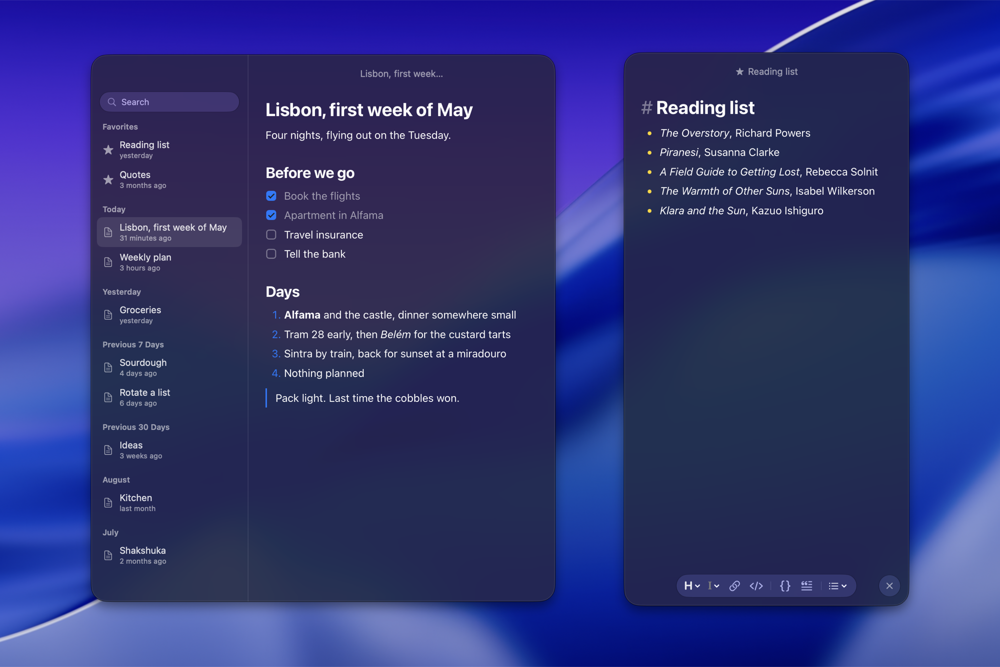

# Memos

[](https://github.com/aicayzer/memos/actions/workflows/ci.yml)
[](https://github.com/aicayzer/memos/releases)
[](LICENSE)

A small native Mac app for memos: one window that floats above whatever you are doing, a memo filling it, edited as formatted text and stored as markdown. Keyboard first, system fonts and colors, nothing decorative.

A native window with a web editor inside it. The native side owns the window, the command palette, browsing, shortcuts and saving; the editor is a bundled web page that works offline.



## Install

```sh
brew install --cask aicayzer/tap/memos
```

Or download the DMG from the [latest release](https://github.com/aicayzer/memos/releases/latest), open it and drag Memos to Applications. It needs macOS 26. The app updates itself: it offers to check on its own, and Check for Updates… in the Memos menu or in Settings' About tab checks now.

## Using it

- Images are pasted or dropped straight in, and a handle on the right edge sizes one. A file that is not an image still inserts its path where it lands.
- `⌘K` command palette, `⌘P` browse memos, `⌘N` new, `⌘D` duplicate, `⇧⌘F` favorite, `⌘[` and `⌘]` back and forward, `⌘F` find, `⇧⌘C` copy as markdown, `⇧⌘S` saves the memo as a markdown file, and Share… in the File menu hands that file to another app.
- `⌃⌥N` shows or hides the window from any app. A menu bar item and the Dock icon are the other ways in; either can be switched off in Settings, and both once a shortcut is set.
- A formatting bar floats at the bottom of the memo: headings, bold, italic, strikethrough, link, code, quote and lists, showing what the caret sits in. Its close button hides it, and the palette brings it back.
- `⌥⌘←` (or `⌘.`), or a double-click on the title bar, opens a side pane listing the memos with a search field; the window grows to the left to make room and shrinks back when it closes. Its own close button, or the same again, closes it, and Settings can open it at launch.
- The window takes the keyboard without bringing the app to the front, so the app you were in keeps the menu bar while you type; a Dock click brings up the Memos menus, whose Memo and Window items are also in the palette.
- Always on Top keeps it above other apps and on every space; the side pane, the window's opacity and tint, the accent, the text size, the size of the app's own controls and the menu bar icon are all set in Settings (`⌘,`), whose Shortcuts tab records the global show/hide shortcut and lets every other shortcut, the editor's included, be changed or given more keys.
- Type markdown as you go: `# `, `- `, `1. `, `- [ ] `, `> ` and backticks turn into formatting. `⌘`-click opens a link, and a URL pasted over selected text links it.
- `⌘⌫` deletes the memo, asking first; the memo after it in the list takes its place.

## Where memos are kept

Internal storage uses a JSON file; Markdown storage uses a folder. `memos path` prints the active location. Images sit in an `images` folder beside it, one file per image, named for the SHA-256 of its bytes. A memo refers to one the ordinary way, as ``, and a width after the alt text sizes it: ``, which is what the resize handle writes. Images are retained to protect pending edits and recovery copies. Save As copies a memo's images into an `images` folder beside the file it writes, so the export stands alone.

## Markdown storage

Settings → Storage has **Store memos as Markdown files**. Turn it on, choose a parent folder, and Memos creates a new folder containing one Markdown file per memo and the images beside them. Turn it off to convert the current files back to internal storage. The app, command line tool and Shortcuts all follow this setting.

Both directions preserve IDs, favorites, dates, text and images. Conversion verifies the destination before committing the switch. Previous storage is retained as a recovery snapshot; it is no longer active, and editing it does not change the current library. Each conversion to files creates a fresh folder so stale copies cannot resurrect deleted notes. Storage settings shows the active location and the previous snapshot.

Files have readable names and a single `memos: {...}` line in YAML frontmatter containing Memos metadata. Keep that line intact. Other frontmatter remains intact. Ordinary UTF-8 `.md` files added to the active folder appear without being rewritten; Memos adds its metadata when you edit or favorite them. Renames and changes made in another editor appear automatically. Files whose formatting the visual editor cannot preserve open in a source editor.

If a memo changes elsewhere while you are editing, Memos preserves the external version and recovers your edit as a separate memo. An unavailable folder shows an error and can be located again in Storage settings; the app never silently falls back to an old copy. iCloud or another folder-sync service is not configured or guaranteed by this feature.

For an isolated development preview, run `./script/build_and_run.sh --verify`. It builds a Debug app with its own identifier and storage; release updates are disabled in Debug builds.

## From the shell

The app carries a command line tool at `Contents/SharedSupport/bin/memos`. The cask puts it on your PATH; from the DMG, a symlink does:

```sh
ln -s /Applications/Memos.app/Contents/SharedSupport/bin/memos ~/.local/bin/memos
```

It reads and writes the same store as the app, which picks up changes as they land.

```sh
memos                      # list, favorites first then newest
memos list plan            # memos whose title or text contains "plan"
memos show plan            # the markdown; a memo is named by id, the start of one, its title or the start of that
memos new "# Call the bank"
pbpaste | memos new
memos append plan "- ring back on Monday"
memos replace plan < notes.md
memos edit plan            # in $EDITOR
memos favorite plan
memos unfavorite plan
memos open plan            # shows the app on that memo
memos delete plan
memos path                 # the active storage location
```

`--json` on `list` and `show` gives every field. `MEMOS_STORE` in the environment points the tool, or the app, at another store file.

## From Shortcuts

The same verbs are App Intents, so Shortcuts and Spotlight can use them: New Memo, Append to Memo, Open Memo, Search Memos, Favorite Memo, Unfavorite Memo and Delete Memo, which asks first. A memo is a value Shortcuts can pass between them, carrying its title and the start of its text. They work through the same store file under the same lock, so the window shows what a shortcut wrote.

## Build

Requires Xcode 27 or later, [XcodeGen](https://github.com/yonaskolb/XcodeGen) and [pnpm](https://pnpm.io). The app build looks for pnpm in `~/Library/pnpm`, `/opt/homebrew/bin` and `/usr/local/bin` as well as the PATH Xcode runs with.

```sh
xcodegen generate
xcodebuild -project Memos.xcodeproj -scheme Memos -configuration Debug build
```

The app icon is an Icon Composer document, `App/Resources/AppIcon.icon`, which Xcode compiles; `App/Resources/AppIcon.png` is the same icon rendered and `Screenshot.png` beside it is the screenshot above; both are for this page only.

The editor is built by a run-script phase during the app build. To work on it alone:

```sh
cd editor
pnpm install
pnpm test
pnpm build
```

`scripts/screenshots.sh` opens the app on a sample store, for screenshots that show no one's own memos.

See `AGENTS.md` for conventions, `editor/BRIDGE.md` for the message protocol between the app and the editor, and `RELEASING.md` for how a release is cut.

## License

[MIT](LICENSE).
