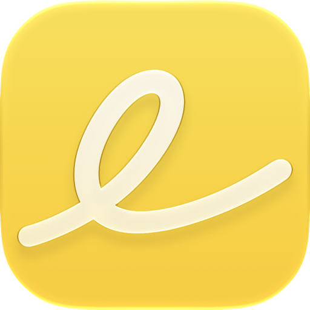
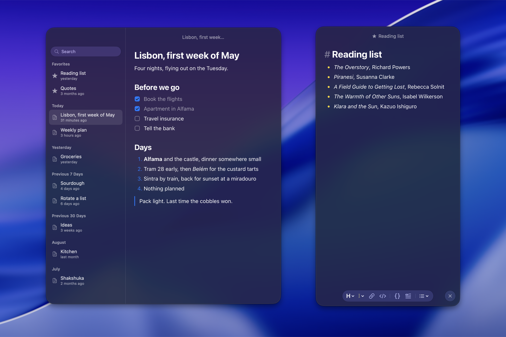

# Memos

A small Mac app for notes that stay close at hand. Open a floating window, write something down, and get back to what you were doing.

## Install

Requires macOS 27 or later. The current beta is available to invited testers through TestFlight as **Little Memos**. The installed app is named **Memos**. A public App Store release is planned.

The optional command-line tool is being prepared as a separate signed download for Apple silicon. It reads and writes the same library as the app and is not included in the TestFlight build. See [release instructions](RELEASING.md) for packaging details.

## Make yourself at home

- Write formatted notes with Markdown shortcuts, images, and checklists.
- Search your memos, keep favorites, and find them in Spotlight.
- Keep notes inside Memos or as Markdown files in a folder you choose.
- Save or share a note as a Markdown file.
- Adjust the window, appearance, and shortcuts in Settings.

## A few shortcuts

| Shortcut | Action |
| --- | --- |
| ⌥B | Show or hide Memos from any app |
| ⌘N | New memo |
| ⌘P | Search memos |
| ⌘K | Command palette |
| ⌘F | Find in the current memo |
| ⌘, | Settings |

## License

[MIT](LICENSE). Development guidance is in [AGENTS.md](AGENTS.md).
